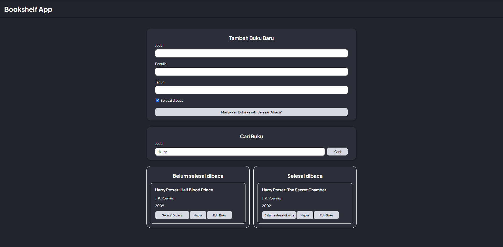

# Bookshelf App

The **Bookshelf App** is a simple web application that allows users to manage their reading list. Users can add books, mark them as completed or unfinished, edit their details, and delete them. Additionally, the app includes a search feature to filter books by title. Data is stored locally in the browser using Local Storage.

## Features
- Add new books with title, author, year, and completion status.
- Mark books as "Finished" or "Unfinished".
- Edit book details.
- Delete books from the list.
- Search for books by title.
- Persistent storage using browser's Local Storage.

## Technologies Used
- HTML, CSS, and JavaScript
- Local Storage for data persistence

## Installation
1. Clone the repository:
   ```bash
   git clone https://github.com/bmmasaputra/bookshelf-app-frontend
   ```
2. Navigate to the project directory:
   ```bash
   cd bookshelf-app-frontend
   ```
3. Open the `index.html` file in your browser to view the application.

## Preview
Below is a preview of the web interface for the Bookshelf App:



## How to Use

### Adding a New Book
1. Fill in the "Title", "Author", and "Year" fields in the "Tambah Buku Baru" section.
2. Check the "Selesai Dibaca" box if the book is completed.
3. Click the "Masukkan Buku ke rak" button to add the book.

### Marking a Book as Completed or Unfinished
1. Locate the book in either the "Belum selesai dibaca" or "Selesai dibaca" section.
2. Click the "Selesai Dibaca" or "Belum selesai dibaca" button to change its status.

### Editing a Book
1. Click the "Edit Buku" button on the book you want to edit.
2. Update the book details in the form.
3. Click the "Simpan Perubahan" button to save your changes.

### Deleting a Book
1. Click the "Hapus" button on the book you want to delete.

### Searching for a Book
1. Enter the book title in the "Cari Buku" section.
2. Click the "Cari" button to filter the books.
3. Clear the search field and click "Cari" again to reset the list.

## Code Structure
- **`index.html`**: Defines the structure and layout of the application.
- **`style.css`**: Contains the styling for the application.
- **`main.js`**: Implements the app's logic, including adding, editing, deleting, and searching books.

## Future Improvements
- Add sorting functionality by year, title, or author.
- Improve the UI/UX with animations and better styling.
- Enable sharing the reading list online using cloud storage.

## License
This project is licensed under the MIT License.

---

Enjoy managing your bookshelf with this simple and intuitive app!